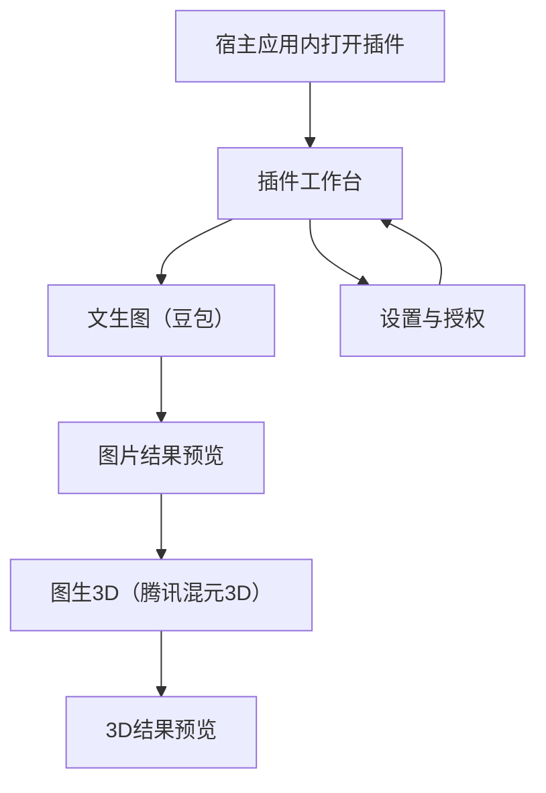

## 1. Product Overview
一款可嵌入到任意桌面 Web 应用的“即插即用”AI 插件面板，提供两项能力：文生图（豆包）与图生3D（腾讯混元3D）。
面向设计/内容生产工具，让用户在不离开宿主应用的情况下完成生成与预览。

## 2. Core Features

### 2.1 User Roles
本插件不强制区分用户角色；宿主应用可选择通过 SSO/用户信息透传实现权限控制。

### 2.2 Feature Module
本插件需求由以下页面组成：
1. **插件工作台**：文生图输入与生成、生成结果预览、图生3D提交与3D预览。
2. **设置与授权**：配置豆包/混元3D的调用凭证（由宿主或管理员提供）、接口连通性校验。

### 2.3 Page Details
| Page Name | Module Name | Feature description |
|-----------|-------------|---------------------|
| 插件工作台 | 能力切换 | 在“文生图/图生3D”两种能力间切换，并展示当前状态（空闲/生成中/失败/成功）。 |
| 插件工作台 | 文生图（豆包） | 输入提示词与必要参数；发起生成；展示生成图片列表/主图预览。 |
| 插件工作台 | 图生3D（腾讯混元3D） | 选择或使用文生图结果作为输入；提交生成3D任务；展示任务状态与结果入口。 |
| 插件工作台 | 结果预览 | 2D：图片放大预览；3D：内嵌3D查看器展示模型（旋转/缩放）。 |
| 设置与授权 | 凭证配置 | 配置豆包与混元3D的调用方式（推荐由后端托管密钥）；保存并提示生效范围。 |
| 设置与授权 | 连通性校验 | 一键测试两项能力的接口可用性；展示错误信息与建议。 |

## 3. Core Process
- 插件使用流：你在宿主应用中打开插件面板 → 选择“文生图”输入提示词并生成 → 在结果中选一张作为“图生3D”的输入 → 提交混元3D生成 → 在3D预览中查看模型。
- 管理/集成流：你在“设置与授权”中配置（或由宿主注入）两项能力的调用凭证 → 执行连通性校验 → 返回工作台使用。

