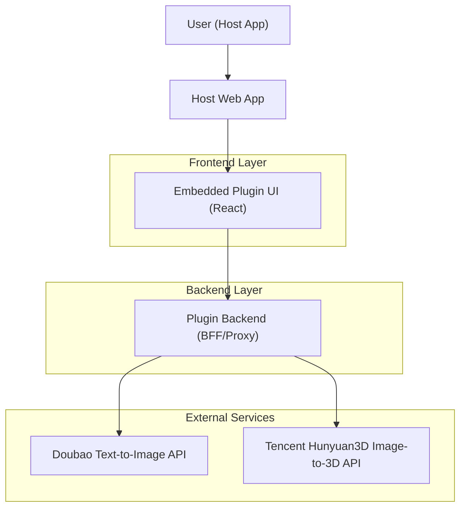
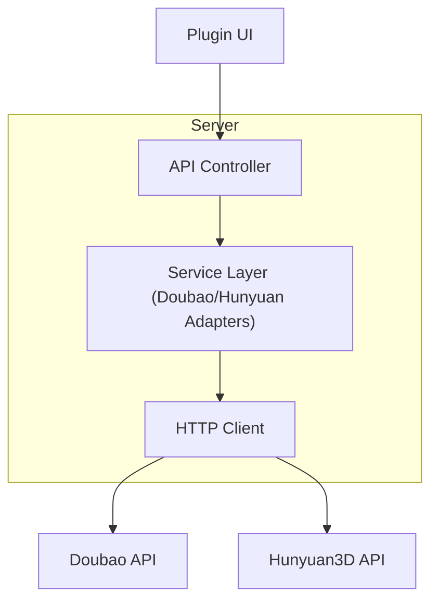

## 1.Architecture design


架构要点：
- 前端插件 UI 只负责交互与预览；不直接持有第三方 API Key，避免密钥暴露。
- 后端 BFF 负责：签名/鉴权、请求转发、轮询/回调整合（若混元3D为异步任务）、统一错误码。
- 与宿主应用的集成以“嵌入方式”为主（iframe / Web Component / React Component），保持最小侵入。

## 2.Technology Description
- Frontend: React@18 + TypeScript + vite + tailwindcss@3
- Backend: Node.js + Express（或同等 Serverless Functions），仅用于密钥托管与第三方 API 代理
- Database: None（除非你需要保存生成历史/资产；本阶段不强制）

## 3.Route definitions
| Route | Purpose |
|-------|---------|
| / | 插件工作台：文生图与图生3D能力入口、预览区 |
| /settings | 设置与授权：配置调用方式与连通性校验 |

## 4.API definitions (If it includes backend services)

### 4.1 Core API
文生图（豆包）
```
POST /api/doubao/t2i
```
Request (JSON):
| Param Name | Param Type | isRequired | Description |
|-----------|------------|------------|-------------|
| prompt | string | true | 文本提示词 |
| size | string | false | 图片尺寸（由后端映射为豆包参数） |
| n | number | false | 生成张数 |

Response (JSON):
| Param Name | Param Type | Description |
|-----------|------------|-------------|
| images | string[] | 生成图片的 URL 或 base64 data URL |

图生3D（腾讯混元3D）
```
POST /api/hunyuan3d/i2t
```
Request (multipart/form-data):
| Param Name | Param Type | isRequired | Description |
|-----------|------------|------------|-------------|
| image | file | true | 输入图片 |

Response (JSON):
| Param Name | Param Type | Description |
|-----------|------------|-------------|
| taskId | string | 任务ID（若异步） |
| status | string | 任务状态 |

查询3D任务状态
```
GET /api/hunyuan3d/tasks/:taskId
```
Response (JSON):
| Param Name | Param Type | Description |
|-----------|------------|-------------|
| status | string | queued/running/succeeded/failed |
| modelUrl | string | 成功时返回3D模型地址（如 glb/obj） |

### 4.2 Shared TypeScript types
```ts
export type JobStatus = "queued" | "running" | "succeeded" | "failed";

export type T2IRequest = { prompt: string; size?: string; n?: number };
export type T2IResponse = { images: string[] };

export type I2_3DCreateResponse = { taskId: string; status: JobStatus };
export type I2_3DTaskResponse = { taskId: string; status: JobStatus; modelUrl?: string; error?: string };
```

## 5.Server architecture diagram (If it includes backend services)


## 嵌入方式（Embedding）

### 1) iframe（最通用，侵入最小）
- 宿主应用在侧边栏/弹窗中嵌入：`<iframe src="https://your-domain/plugin" />`
- 通信：使用 `window.postMessage` 双向传递
  - 宿主 -> 插件：用户信息/主题/初始图片
  - 插件 -> 宿主：生成结果（图片URL、modelUrl）、加载状态

### 2) Web Component（适合非 React 宿主）
- 打包为自定义元素：`<ai-plugin-panel></ai-plugin-panel>`
- 属性/事件：
  - attributes：`theme`, `locale`, `initialImageUrl`
  - events：`onImageGenerated`, `onModelGenerated`, `onError`

### 3) React Component（适合 React 宿主）
- 以 npm 包提供：`<AiPluginPanel apiBaseUrl=... onResult=... />`
- 优点：统一路由与主题体系；缺点：与宿主依赖耦合更深

## 安全与密钥管理（必须）
- 第三方 API Key 仅存在于后端环境变量/密钥管理中（例如：DOUBAO_API_KEY、HUNYUAN3D_API_KEY）。
- 前端只调用你自己的 `/api/*`，后端再调用豆包与混元3D。
- 如宿主应用必须自带密钥：也应通过宿主后端签发短期 Token，再由插件后端验证后放行。